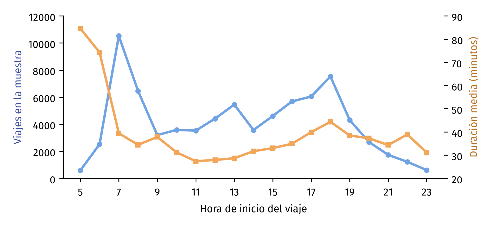
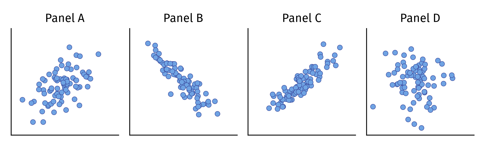
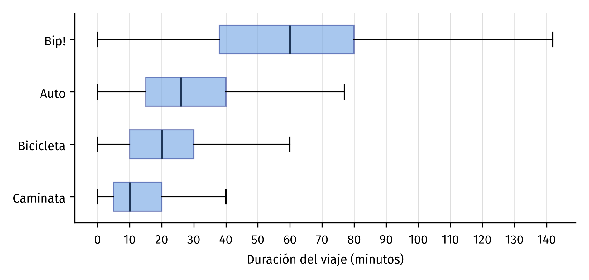
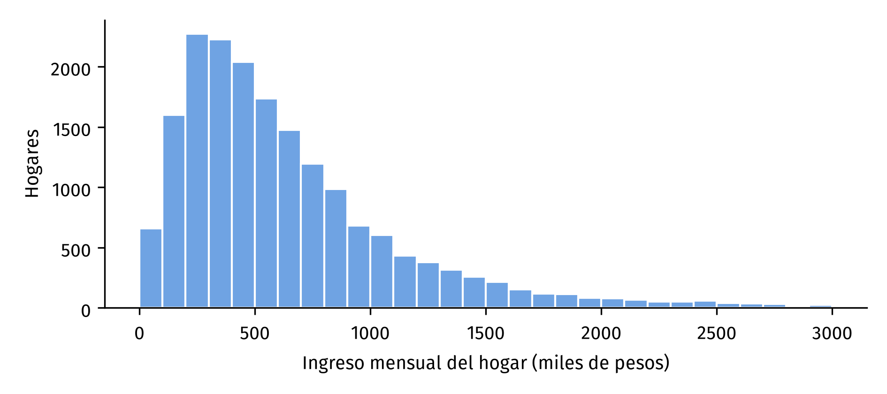
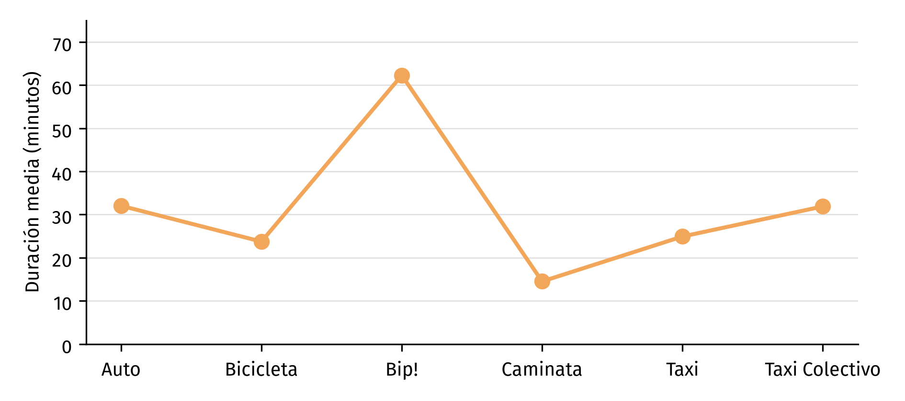

# Guía de estudio: Certamen 1

**Universidad Técnica Federico Santa María** · Departamento de Informática  
**INF-396 Introducción a la Ciencia de Datos** · Segundo semestre 2026  
**Certamen 1**: unidades 1 a 5, incluida la regresión lineal. Escrito e individual, sin
computador ni apuntes; se permite calculadora básica.

## Cómo es el certamen

Las preguntas son de tres tipos, y esta guía tiene ejercicios de cada uno. El puntaje del
certamen se reparte en 20% alternativas, 40% desarrollo y 40% cálculo:

- **Alternativas**: una sola opción correcta; miden si el concepto está claro.
- **Desarrollo**: respuestas breves, de un párrafo, que argumentan con los conceptos
  del curso. Se evalúa el argumento, no la extensión. Algunas parten de un gráfico
  que hay que leer: qué codifica, qué resúmenes se sacan de él y qué está bien o mal
  en su diseño.
- **Cálculo**: operaciones simples con pocos números, del tipo que se hace a mano en
  un par de minutos. Nunca se pide programar; sí se pide leer código o la salida de
  un modelo e interpretarla.

El material de estudio son las slides y los notebooks de las clases 01 a 04, la clase
de inferencia del 2 de octubre, y las lecturas de los controles Q1 (O'Neil) y Q2
(Cairo). Los ejercicios usan datos de la Encuesta Origen Destino (EOD) de Santiago
2012, los mismos de las clases. La guía va ordenada por tipo de pregunta; el temario por unidad está a continuación.

## Temario

- **1. Fundamentos y ética (clase 01, lectura de O'Neil).** Qué es la ciencia de datos y
  sus tres competencias; el ciclo de un proyecto de datos; las seis formas de daño de
  una IA irresponsable; falsos positivos y falsos negativos; los tres elementos de un
  arma de destrucción matemática (ADM) y el ciclo de retroalimentación pernicioso;
  documentar los datos y los modelos con sus límites.
- **2. Modelos, correlación y tipos de datos (clase 02).** La definición de modelo, Y =
  f(X) + ε, y qué representa cada término; inferencia y predicción; el coeficiente de
  Pearson (asociación lineal) y el de Spearman (calculado sobre los rangos, asociación
  monótona); asociación y causalidad; los tipos de datos y la diferencia entre tipo
  estadístico y tipo computacional; qué es el análisis exploratorio de datos; los
  factores de expansión y la pregunta "¿de quién habla este número?".
- **3. Estadística descriptiva y calidad de datos (clase 03, segundo bloque).** Media,
  mediana y moda; cuándo la media no basta; percentiles y cuartiles; el rango
  intercuartil (IQR); el boxplot y la regla de Tukey para marcar valores atípicos (1,5
  veces el IQR más allá de los cuartiles); faltantes, incluidos los disfrazados de
  número, duplicados y valores imposibles; la lista de verificación antes de analizar.
- **4. Visualización (clase 03, primer bloque, y lectura de Cairo).** Marcas y canales;
  qué canales se leen con más precisión (posición en una escala común y largo, antes que
  ángulo, área y color); discriminabilidad, separabilidad y saliencia; paletas
  secuenciales, divergentes y cualitativas; por qué las barras comparan bien y las
  tortas mal; cómo mienten los gráficos de Cairo: ejes truncados, dobles escalas,
  perspectiva 3D, proporciones y razón de aspecto, línea base, escalas logarítmicas y
  cortes de color en los mapas.
- **5. Regresión lineal (clase 04).** La matriz de correlación como mapa para elegir
  variables y el cuarteto de Anscombe; mínimos cuadrados; pendiente e intercepto y su
  lectura; residuos; r² como fracción de la variación explicada; la regresión ponderada
  (WLS) con factores de expansión; la regresión múltiple y la lectura de cada
  coeficiente con las demás variables fijas; R² y R² ajustado; variables categóricas
  como dummies con una categoría de referencia; modelos en logaritmo; qué informa el
  summary de statsmodels (coef, std err, intervalo, valor p).
- **6. Inferencia estadística (clase del 2 de octubre).** Por qué una muestra distinta
  daría una pendiente distinta; el intervalo de confianza como propiedad del método
  (construido así, atrapa el valor verdadero en el 95% de las muestras); el valor p como
  respuesta a "si en la población el efecto fuera cero, ¿qué tan raro sería este
  coeficiente por azar?"; qué achica el error de un coeficiente; la idea del bootstrap.

## 1. Alternativas

**1.1 (alternativas, fundamentos y ética)** En el estudio de Kleinberg y coautores sobre las fianzas en Nueva
York, las personas afrodescendientes eran el 57% de los presos sin fianza con las
decisiones de los jueces y el 60% con el mejor modelo entrenado con esos mismos datos.
¿Qué ilustra ese resultado?

- a) Que el modelo elimina el sesgo de los jueces.
- b) Que el modelo hereda el sesgo de los datos y lo amplifica.
- c) Que el modelo es más preciso, y por eso encarcela más.
- d) Que los datos de Nueva York estaban mal registrados.

**1.2 (alternativas, fundamentos y ética)** Según O'Neil, los tres elementos que caracterizan a un arma de
destrucción matemática son:

- a) El sesgo, la varianza y el error.
- b) El volumen, la velocidad y la variedad.
- c) La opacidad, la escala y el daño.
- d) La precisión, la cobertura y la transparencia.

**1.3 (alternativas, modelos y correlación)** La relación entre dos variables es creciente pero curva, y hay
unos pocos valores extremos. ¿Qué coeficiente describe mejor la asociación?

- a) Pearson, porque mide cualquier tipo de asociación.
- b) Spearman, porque trabaja con los rangos y no le afectan los extremos.
- c) Ninguno: con extremos no se puede calcular una correlación.
- d) Pearson, siempre que se eliminen primero los valores extremos.

**1.4 (alternativas, modelos y correlación)** En la EOD, la variable Sexo viene codificada como 1 y 2, y su
promedio es 1,53. ¿Qué tipo de variable es y qué significa ese promedio?

- a) Numérica discreta; el promedio indica que hay más mujeres que hombres.
- b) Categórica nominal; el promedio no significa nada, aunque Pandas lo calcule.
- c) Categórica ordinal; el promedio indica el nivel medio.
- d) Numérica continua; el promedio es la proporción de mujeres.

**1.5 (alternativas, estadística descriptiva)** En un boxplot, el bigote superior llega hasta:

- a) El valor máximo de los datos, siempre.
- b) El tercer cuartil más 1,5 veces el IQR, exactamente.
- c) El mayor valor observado que no supera la cerca de Tukey; los puntos más allá se
  dibujan aparte como atípicos.
- d) El percentil 95.

**1.6 (alternativas, visualización)** Va a colorear un mapa de comunas según la diferencia entre la
duración media de los viajes de cada comuna y la duración media de la ciudad, que
puede ser positiva o negativa. ¿Qué paleta corresponde?

- a) Secuencial, de claro a oscuro.
- b) Divergente, con dos colores y un punto neutro en el cero.
- c) Cualitativa, un color por comuna.
- d) Un arcoíris, para que se distingan bien los valores.

**1.7 (alternativas, visualización)** El gráfico muestra, por hora del día, el número de
viajes de la EOD en el eje izquierdo y la duración media de esos viajes en el eje
derecho. Las dos líneas se cruzan. Según Cairo, ¿cuál es el problema?

- a) Ninguno, mientras cada eje tenga su rótulo.
- b) Que el cruce y la pendiente de cada línea dependen de las escalas elegidas, así
  que el gráfico sugiere una comparación que los datos no sostienen.
- c) Que dos variables nunca pueden ir en el mismo gráfico.
- d) Que las líneas deberían ser barras.

**1.8 (alternativas, regresión lineal)** Al convertir el modo de transporte en dummies, se saca una
categoría y queda de referencia. ¿Por qué?

- a) Para ahorrar memoria.
- b) Porque si entraran todas, las columnas sumarían siempre 1, igual que el intercepto,
  y el modelo no podría distinguir sus efectos.
- c) Porque la categoría de referencia no tiene efecto.
- d) Porque statsmodels solo acepta hasta cinco categorías.

**1.9 (alternativas, regresión lineal)** La correlación entre ingreso y duración es −0,34 cuando cada
punto es el promedio de una comuna, y 0,00 cuando cada punto es un viaje. ¿Qué explica
la diferencia?

- a) Un error de cálculo: la correlación no puede cambiar con la unidad de análisis.
- b) Que los promedios esconden a los individuos: una asociación entre promedios de
  grupos no implica la misma asociación entre las personas de esos grupos.
- c) Que los viajes individuales tienen faltantes.
- d) Que el ingreso por viaje está en otra unidad.

**1.10 (alternativas, inferencia)** El error estándar de la pendiente se achica cuando:

- a) Hay más ruido en los residuos.
- b) Hay más puntos y la variable x está más repartida.
- c) La pendiente es más grande.
- d) Se usan menos decimales.

## 2. Desarrollo

**2.1 (desarrollo, fundamentos y ética)** Explique qué es un ciclo de retroalimentación pernicioso con un
ejemplo distinto de los del libro, y diga por qué el modelo del béisbol que describe
O'Neil no lo produce.

**2.2 (desarrollo, fundamentos y ética)** Un equipo publica un modelo que predice la deserción escolar y
reporta una precisión global del 91%. ¿Qué información pediría usted sobre el modelo
antes de usarlo, y por qué un buen promedio no basta?

**2.3 (desarrollo, modelos y correlación)** Clasifique cada pregunta como de inferencia o de predicción y
justifique: (i) ¿cómo se asocia el ingreso del hogar con el uso del transporte público?
(ii) ¿cuántos viajes tendrá esta zona un día laboral del próximo año?

**2.4 (desarrollo, modelos y correlación)** Una encuesta muestra que las comunas con más ciclovías tienen más
viajes en bicicleta. Un titular dice que "construir ciclovías aumenta el uso de la
bicicleta". Explique por qué los datos no respaldan ese verbo y qué otra explicación
admite la asociación.

**2.5 (desarrollo con gráfico, modelos y correlación)** Los cuatro paneles muestran nubes de puntos con coeficientes de
Pearson de −0,9; 0; 0,5 y 0,9, en algún orden.

(i) Asigne cada coeficiente a su panel. (ii) Diga qué mira en la nube para decidir el
signo y qué mira para decidir la fuerza.

**2.6 (desarrollo con gráfico, estadística descriptiva)** El boxplot muestra la duración de los viajes de un día laboral de la
EOD según el modo. Los valores atípicos se ocultaron para que las cajas se lean.

(i) Lea la mediana, los cuartiles y el IQR de Bip! y de Caminata. (ii) ¿Qué modo tiene
más dispersión en su mitad central? (iii) Con la regla de Tukey, calcule hasta dónde
puede llegar como máximo el bigote superior de Bip! y compárelo con el gráfico.
(iv) ¿Se puede leer la media de cada modo en este gráfico? ¿Dónde esperaría que
quedara respecto de la mediana?

**2.7 (desarrollo con gráfico, estadística descriptiva)** El histograma muestra el ingreso mensual de los hogares de la EOD,
hasta tres millones de pesos.

(i) Describa la forma de la distribución. (ii) Dos resúmenes de estos hogares son
500.000 y 635.000 pesos: ¿cuál es la media y cuál la mediana? Justifique con la forma.
(iii) ¿Cuál de los dos reportaría como el ingreso típico de un hogar? (iv) Con todos
los hogares, sin el corte en tres millones, los resúmenes son 508.000 y 688.000. ¿Por
qué uno se movió mucho más que el otro?

**2.8 (desarrollo, visualización)** Una empresa presenta sus ventas anuales con barras en tres
dimensiones y perspectiva, y el eje vertical parte en el 90% del valor mínimo.
Identifique los dos problemas, explique qué percepción distorsiona cada uno y describa
cómo debería verse el gráfico corregido.

**2.9 (desarrollo, visualización)** Cairo sostiene que un gráfico de barras debe partir de cero, pero
que un gráfico de líneas no siempre. Explique la razón en términos de la codificación
que usa cada uno.

**2.10 (desarrollo, visualización)** Explique con los conceptos de marcas y canales por qué un gráfico
de torta con seis categorías de tamaño parecido es difícil de leer, y qué gráfico lo
reemplaza.

**2.11 (desarrollo con gráfico, visualización)** Alguien resume la duración media del viaje por modo con este gráfico.

(i) Identifique qué está mal en la codificación y qué sugiere la línea que los datos
no dicen. (ii) Describa cómo rehacer el gráfico. (iii) ¿Cambiaría la respuesta si el
eje horizontal fuera la hora de inicio del viaje en vez del modo?

**2.12 (desarrollo, regresión lineal)** Los viajes en Bip! duran 62 minutos en promedio y los a pie 15,
pero los primeros recorren 7,5 km y los segundos 0,4. Explique por qué comparar esos
promedios a secas mezcla dos efectos, y cómo la regresión múltiple aísla el efecto del
modo.

**2.13 (desarrollo, regresión lineal)** ¿Por qué la regresión sobre datos de la EOD se ajusta con pesos
(WLS) en vez de mínimos cuadrados ordinarios? Relacione la respuesta con los factores
de expansión de la clase 02.

**2.14 (desarrollo, regresión lineal)** Sin la comuna de Lo Barnechea, la correlación casi no cambia
(sigue en −0,34) pero la pendiente pasa de −4,8 a −5,8. Explique qué muestra ese
resultado sobre la sensibilidad de la correlación y de la regresión a un punto extremo,
y qué haría usted con ese punto.

**2.15 (desarrollo, inferencia)** El intervalo de confianza de la pendiente es (−8,9; −0,8). Explique
qué afirma ese intervalo y qué no afirma. En particular: ¿es correcto decir que hay un
95% de probabilidad de que la pendiente verdadera esté en ese rango?

**2.16 (desarrollo, inferencia)** El valor p de la pendiente es 0,021. Otro modelo tiene un
coeficiente con valor p de 0,40. Explique qué se concluye en cada caso y por qué un
valor p pequeño no dice nada sobre el tamaño del efecto.

**2.17 (desarrollo, inferencia)** Describa, paso a paso, cómo obtendría con bootstrap un intervalo
para la mediana del ingreso de los hogares de la EOD, y por qué conviene el bootstrap
en ese caso y no una fórmula.

## 3. Cálculo

**3.1 (cálculo, modelos y correlación)** Cinco viajes de un día laboral registrados en la EOD tuvieron estas
duraciones y distancias (en línea recta):

| Viaje | Duración (min) | Distancia (km) |
|-------|----------------|----------------|
| A | 10 | 0,14 |
| B | 13 | 0,13 |
| C | 20 | 1,28 |
| D | 30 | 6,33 |
| E | 70 | 17,46 |

Calcule el coeficiente de Spearman entre duración y distancia con la fórmula
ρ = 1 − 6·Σd² / (n·(n² − 1)), donde d es la diferencia entre los rangos de un mismo
viaje en las dos variables. Indique los rangos de cada variable y el resultado.

**3.2 (cálculo, modelos y correlación)** Suponga cuatro observaciones con x = 1, 2, 3, 4 e y = 3, 5, 4, 8.
Calcule el coeficiente de Pearson con la fórmula r = Σ(xᵢ − x̄)(yᵢ − ȳ) /
√(Σ(xᵢ − x̄)² · Σ(yᵢ − ȳ)²). Diga si la asociación es positiva o negativa y si es fuerte.

**3.3 (cálculo, modelos y correlación)** Tres personas encuestadas hicieron 0, 2 y 4 viajes en el día, con
factores de expansión 100, 200 y 300. Calcule el promedio simple de viajes por persona
y el promedio ponderado por el factor. ¿Cuál de los dos habla de la ciudad y cuál de la
muestra? ¿A cuántas personas de Santiago representan las tres filas?

**3.4 (cálculo, estadística descriptiva)** Nueve viajes de la EOD duraron, en minutos: 30, 70, 15, 20, 35, 13,
10, 60 y 160. Ordénelos y calcule la mediana, el primer y el tercer cuartil (como la
mediana de cada mitad, sin incluir la mediana), el IQR y las cercas de Tukey. ¿Hay
valores atípicos? Calcule también la media y explique la diferencia con la mediana.

**3.5 (cálculo, regresión lineal)** La recta de la clase 04, ajustada sobre 45 comunas, es
duración = 38,3 − 4,8 · ingreso, con el ingreso medio del hogar en millones de pesos y
la duración media en minutos. (i) Prediga la duración media para una comuna con
ingreso 0,5 millones y para otra con 2,0 millones. (ii) Una comuna con ingreso 1,0
millones tiene una duración observada de 40 minutos: calcule su residuo e interprete
el signo. (iii) ¿Cuánto cambia la predicción por cada millón adicional de ingreso?

**3.6 (cálculo, regresión lineal)** La correlación entre ingreso y duración por comuna es r = −0,34.
Calcule r² e interprete el valor en una frase.

**3.7 (cálculo, regresión lineal)** En la clase 04, el modelo de los vehículos por hogar era
vehículos = 0,20 + 0,50 · ingreso (ingreso en millones). (i) ¿Cuántos vehículos
predice para un hogar con ingreso de 1,5 millones? (ii) ¿Qué significa el 0,20?
(iii) Al agregar el número de personas del hogar, el coeficiente del ingreso pasó de
0,50 a 0,48 y el R² subió de 0,261 a 0,266. ¿Qué se concluye sobre la variable
agregada?

**3.8 (cálculo, regresión lineal)** En el modelo de la duración de los viajes, con la duración y la
distancia en logaritmo y el auto como categoría de referencia, la dummy de Bip! tiene
coeficiente 0,27 y la de taxi 0,02. Sabiendo que 10 elevado a 0,27 es 1,87, interprete
el coeficiente de Bip! en una frase. ¿Qué se puede decir del taxi?

**3.9 (cálculo, regresión lineal)** La fila de la pendiente en el summary de la recta de la pregunta 3.5
es la siguiente:

| | coef | std err | P>\|t\| | [0.025 | 0.975] |
|---|---|---|---|---|---|
| ingreso | −4,8 | 2,0 | 0,021 | −8,9 | −0,8 |

(i) ¿El intervalo incluye el cero? ¿Qué implica eso sobre el signo de la pendiente?
(ii) ¿Qué significa el valor p de 0,021? (iii) ¿Es precisa la magnitud del efecto?
Justifique con el intervalo.

**3.10 (cálculo, inferencia)** Para estimar la mediana de la duración de los viajes se tomó una
muestra de cinco viajes: 10, 15, 20, 30 y 70 minutos. Tres remuestreos con reemplazo
dieron:

| Remuestreo | Duraciones (min) |
|------------|------------------|
| R1 | 15, 15, 30, 70, 10 |
| R2 | 20, 10, 20, 30, 20 |
| R3 | 70, 70, 15, 30, 20 |

(i) Calcule la mediana de la muestra original y la de cada remuestreo. (ii) Explique
por qué en R1 el 15 aparece dos veces y el 20 no aparece. (iii) Con 1.000 remuestreos,
los percentiles 2,5 y 97,5 de las medianas fueron 12 y 40 minutos: escriba el
intervalo e interprételo. (iv) Si la muestra original tuviera 500 viajes en vez de 5,
¿el intervalo sería más ancho o más angosto? ¿Por qué?
